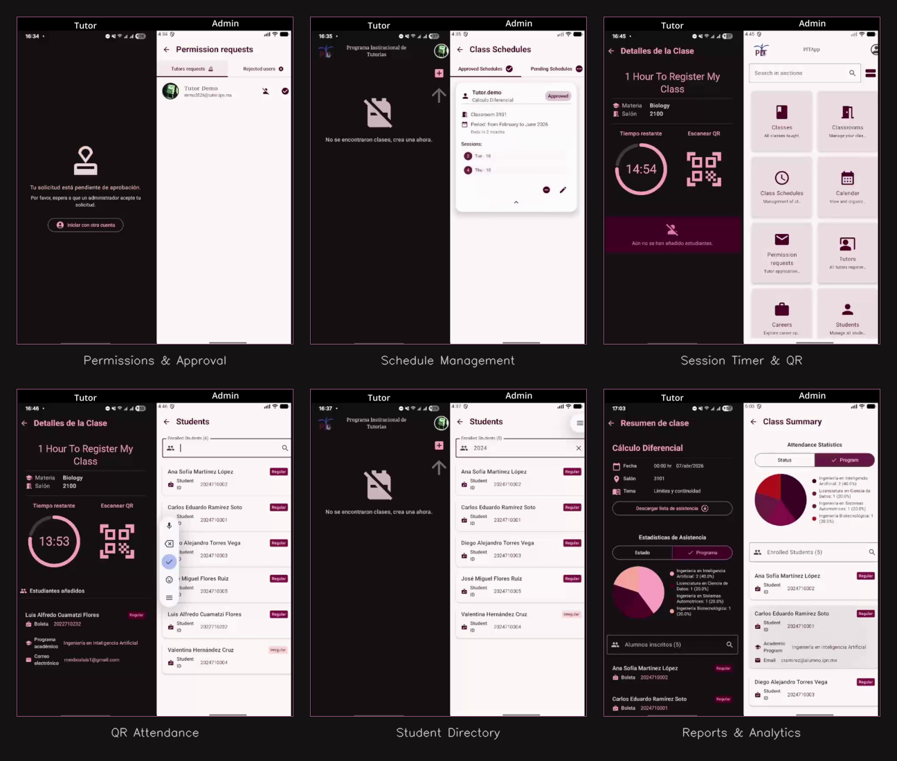

# TutorTrack — PIT IPN 🦉

[](https://kotlinlang.org/)
[](https://developer.android.com/jetpack/compose)
[](https://firebase.google.com/)
[](https://m3.material.io/)

Native Android app for the **Programa Institucional de Tutorías** at Instituto Politécnico Nacional. Tutors scan QR codes, students check in, and admins manage attendance records in real time.

---

## 📚 About The Project

| Feature | Details |
| --- | --- |
| 🎯 **Purpose** | Digitize attendance tracking for the PIT program, from schedule creation to CSV report generation. |
| ⚙️ **Architecture** | Single-activity app built with Jetpack Compose, MVVM-ish structure, and Firestore real-time listeners. |
| 💾 **Data** | Firebase Authentication (Email/Password), Cloud Firestore (real-time sync + offline cache), Firebase Storage (profile photos). |
| 🔒 **Anti-Fraud** | Device policy checks require automatic date/time and a valid Mexican timezone. |
| 👥 **Roles** | Three tiers: **Admin** (full control), **Peer Tutor** (student who tutors), **Advisor** (teacher who advises). |

---

## 🚀 Tech Stack

### Android & UI


- **Kotlin & Jetpack Compose:** Jetpack Compose UI with Material 3 components and a single `NavHost` navigation flow.
- **ZXing (JourneyApps):** QR code scanning for instant student check-in.
- **kotlin-csv:** Client-side CSV report generation.

### Cloud & Backend


- **Firebase Authentication:** Email/Password sign-in with role-based access.
- **Cloud Firestore:** Real-time sync with offline cache for attendance records.
- **Firebase Storage:** Profile photo upload and management.

---

<div align="center">

## 🔧 Highlighted Features

| Feature | Description |
| :---: | :---: |
| **QR Attendance** | Scan student credentials with validation and duplicate detection. |
| **Scheduling** | Create weekly schedules with overlap detection for classrooms and tutors. |
| **Session Lifecycle** | 60-minute session timer with a 45-minute scan window. |
| **Role Separation** | Admin approves tutors and schedules. Peer tutors (students) and advisors (teachers) are tracked separately. |
| **Academic Calendar** | Non-working days and exam periods are cross-referenced with schedules. |
| **Reports & CSV Export** | Attendance summaries with pie charts, per-tutor views, and CSV export. |
| **Device Policy** | Usage is restricted unless automatic time is enabled and the timezone matches a valid Mexican zone. |
| **Offline Sync** | Firestore offline cache allows attendance data to sync after connectivity is restored. |

</div>

---

## 📸 View

<p align="center">
  <br>
  <sub>Each frame shows both perspectives side by side — Tutor (left, dark) and Admin (right, light)</sub>
</p>

---

## 🎬 Demo

<p align="center">

[](https://youtu.be/Uh_GV_2lFNg)

</p>

---

## 🏛️ Architecture

```
Kotlin · Single Activity · Jetpack Compose
```

```
core/
  devicepolicy/     → AppGuard, TimeZoneConfig, network & time monitors
datasource/
  AuthManager       → Firebase Auth wrapper
  FireStoreManager  → All Firestore CRUD (schedules, classes, students, calendar)
model/              → Data classes + date/time extensions
ui/
  features/
    auth/           → Login, registration (student vs teacher flow)
    calendar/       → Non-working days, exam periods
    careers/        → Academic programs (hardcoded for UPIIT)
    classes/        → Active class, QR scanner, past classes, CSV export
    classrooms/     → Classroom CRUD
    home/           → Tutor dashboard, admin dashboard
    permissions/    → Role management (approve/reject tutors)
    profile/        → User profile with photo upload
    scheduling/     → Schedule creation, editing, conflict detection
  shared/           → Reusable components, formatting utilities
```

---

## 🛠️ Setup

### Prerequisites

- Android Studio Hedgehog or later
- JDK 17+
- A Firebase project with Auth, Firestore, and Storage enabled

### Steps

```bash
git clone https://github.com/MexboxLuis/PIT-IPN-App.git
```

1. Open the project in Android Studio
2. Create a Firebase project at [console.firebase.google.com](https://console.firebase.google.com)
3. Add an Android app with package name `com.example.pitapp`
4. Download `google-services.json` and place it in `app/`
5. Enable **Authentication** (Email/Password), **Cloud Firestore**, and **Firebase Storage**
6. Run on a physical device or emulator with API 26+

> **Note:** The timezone policy requires the device to be set to a valid Mexican timezone. On emulators, go to Settings → System → Date & Time and set the timezone manually to `America/Mexico_City`.

---

## 🔐 Device Policy

The app checks two device conditions before allowing usage:

| Check | What it verifies | Why it matters |
| --- | --- | --- |
| **Automatic Time** | `Settings.Global.AUTO_TIME == 1` | Prevents manual clock manipulation to fake attendance timestamps. |
| **Valid Timezone** | Device timezone ∈ `VALID_ZONE_IDS` | Ensures all timestamps are in Mexican time, regardless of device locale. |

### Valid Timezone IDs

| Zone ID | Region | UTC Offset |
| --- | --- | --- |
| `America/Mexico_City` | Centro (CDMX, Puebla, Oaxaca) | UTC-6 |
| `America/Monterrey` | Noreste (NL, Coahuila) | UTC-6 |
| `America/Merida` | Sureste (Yucatán, Campeche) | UTC-6 |
| `America/Bahia_Banderas` | Jalisco / Nayarit | UTC-6 |
| `America/Matamoros` | Frontera noreste (DST de EE.UU.) | UTC-6/UTC-5 |

### How to change the canonical timezone

All timezone logic is centralized in a single file:

```
app/src/main/java/com/example/pitapp/core/devicepolicy/TimeZoneConfig.kt
```

To support a different campus (e.g., Cancún → `America/Cancun`, UTC-5):

1. Change `CANONICAL_ZONE_ID` to the new zone
2. Add the new zone to `VALID_ZONE_IDS`
3. Recompile — all `Calendar` / `ZoneId` logic updates automatically

---

## 📐 Schedule Overlap Detection

The scheduling engine performs **two types of overlap checks** before any schedule is approved:

| Check | What it prevents |
| --- | --- |
| **Classroom overlap** | Two different tutors assigned to the same room at the same time. |
| **Tutor overlap** | The same tutor assigned to two different sessions at the same time. |

Both checks consider:
- The **date range** (startYear/startMonth → endYear/endMonth) must overlap
- Within the overlapping period, at least one **session** shares the same `dayOfWeek` AND `startTime`

Overlap is checked before schedule approval and again during schedule editing.

---

## 🔮 Future Development

If this project were to scale beyond a single campus or move to production, these are the areas that would need attention:

### Backend & Infrastructure

| Area | Current State | What's Needed |
| --- | --- | --- |
| **Server-side validation** | All validation is client-side (Kotlin) | Firestore Security Rules or Cloud Functions to enforce overlap, permissions, and data integrity server-side |
| **Authentication** | Email/Password only | SSO integration with IPN's institutional auth system (SAES/SIP) |
| **Multi-campus support** | Single canonical timezone | Per-campus timezone configuration, possibly stored in Firestore instead of hardcoded |
| **Push notifications** | None | Firebase Cloud Messaging for schedule approvals, class reminders, and period alerts |
| **QR generation** | External (printed credentials) | In-app dynamic QR generation with expiration tokens for enhanced security |

### Data & Reporting

| Area | Current State | What's Needed |
| --- | --- | --- |
| **Reports & CSV Export** | Attendance summaries with pie charts, per-tutor views, and CSV export | Server-side generation via Cloud Functions for large datasets |
| **Analytics** | Basic pie charts (regular vs irregular) | Dashboard with trends over time, attendance rates, dropout predictions |
| **Data retention** | No automatic cleanup | Archival policies for past semesters, GDPR/data protection compliance |

### Security Rules (Firestore)

Currently, the app relies on client-side permission checks. For production, Firestore Security Rules should enforce:

```javascript
// Example: Only admins (permission == 2) can approve schedules
match /saved_schedules/{scheduleId} {
  allow update: if request.auth != null
    && get(/databases/$(database)/documents/saved_users/$(request.auth.token.email)).data.permission == 2;
}

// Example: Tutors can only read/write their own classes
match /saved_instant_classes/{classId} {
  allow create: if request.auth != null
    && request.resource.data.tutorEmail == request.auth.token.email;
}
```

### Key Design Decisions Worth Preserving

| Decision | Rationale |
| --- | --- |
| **Centralized timezone** (`TimeZoneConfig.kt`) | One file controls all time logic — prevents drift across features |
| **Client-side overlap detection** | Provides instant UX feedback without waiting for server roundtrip |
| **Peer Tutor vs Advisor split** | `studentId != null` + `academicProgram != null` = peer tutor; both null = advisor |
| **45-min scan window** | Prevents late additions while giving reasonable check-in time |
| **Offline-first with Firestore cache** | Sessions in progress survive internet drops — critical for campus WiFi issues |

---

## 📄 License

This project was developed as part of an academic program at IPN. See the repository for licensing details.
